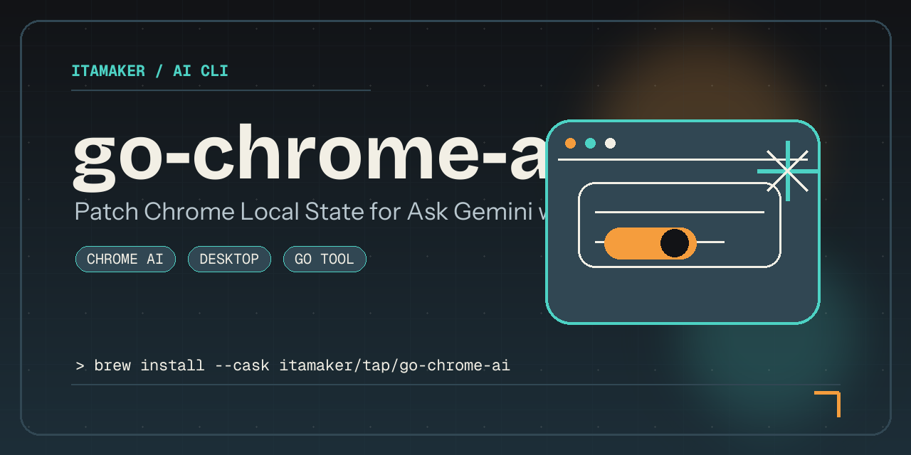
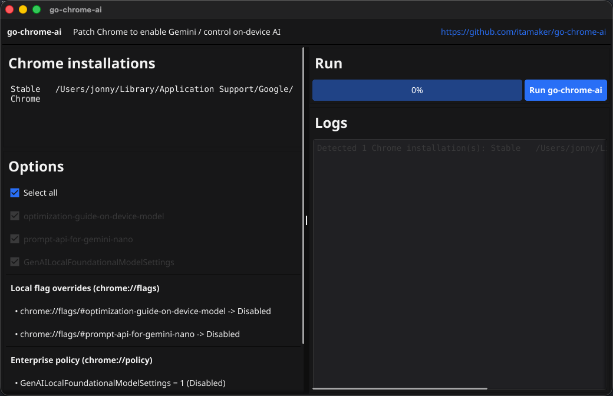

# go-chrome-ai

[](#contributors-)

`go-chrome-ai` is a cross-platform Chrome profile patcher written in Go, with both **CLI** and **GUI** modes.
It helps enable Chrome AI-related features (including **Ask Gemini**) without reinstalling Chrome or recreating your profile, and can also **block Chrome from silently downloading the on-device Gemini Nano model** (~2–4 GB) by flipping the relevant `chrome://flags` and applying Google's [`GenAILocalFoundationalModelSettings`](https://chromeenterprise.google/policies/gen-ai-local-foundational-model-settings/) Enterprise policy.



## Support

[](https://buymeacoffee.com/amaker)

## Quickstart

### Install

```bash
brew install --cask itamaker/tap/go-chrome-ai
```

```bash
curl -fsSL https://raw.githubusercontent.com/itamaker/go-chrome-ai/main/scripts/install.sh | sh
```

<details>
<summary>You can also download binaries from <a href="https://github.com/itamaker/go-chrome-ai/releases">GitHub Releases</a>.</summary>

Each archive contains a single executable: `go-chrome-ai`.
The macOS archives include the GUI-capable binary. Linux and Windows releases ship the CLI binary for portable installs.

</details>

### First Run

Run:

```bash
go-chrome-ai        # CLI mode on every release
go-chrome-ai gui    # GUI mode on macOS release builds or source builds
```

On some macOS systems, Gatekeeper may block first launch for downloaded binaries. If that happens, run:

```bash
xattr -d com.apple.quarantine $(which go-chrome-ai)
```

Typical warning:

> Apple could not verify “go-chrome-ai” is free of malware that may harm your Mac or compromise your privacy.

It enables Chrome AI-related features (such as **Ask Gemini**) by patching local profile state:

- `is_glic_eligible` (recursive) -> `true`
- `variations_country` -> `"us"`
- `variations_permanent_consistency_country` -> `["<last_version>", "us"]` (if field exists and is patchable)

It can also **block on-device AI model downloads** (Gemini Nano), which is the default in both CLI and GUI. The block applies three changes:

- `chrome://flags/#optimization-guide-on-device-model` -> Disabled
- `chrome://flags/#prompt-api-for-gemini-nano` -> Disabled
- `GenAILocalFoundationalModelSettings = 1` written to the OS managed-policy store
  - macOS: `defaults write com.google.Chrome GenAILocalFoundationalModelSettings -int 1`
  - Linux: `/etc/opt/chrome/policies/managed/go-chrome-ai.json` (needs sudo)
  - Windows: `HKLM\Software\Policies\Google\Chrome` REG_DWORD

Because the third change is an Enterprise policy, Chrome will display the "managed by your organization" banner afterwards. All three are independently selectable options — the two `chrome://flags` entries (CLI: `-disable-flag`, GUI: per-flag checkboxes) and the `chrome://policy` write (CLI: `-disable-ai-policy`, GUI: policy checkbox) — or all three at once via the "select all" option (CLI: `-disable-ai-download`, GUI: "Select all" checkbox, both default on). Turn off `-disable-ai-download` (CLI) or "Select all" (GUI) to pick and choose, e.g. to disable the flags without triggering the Enterprise-policy banner, or vice versa.

Every run fully syncs Chrome to the current selection, in both directions: a selected item is applied (flag forced to Disabled / policy written), and a **deselected item is actively reverted** — its `chrome://flags` override is removed (back to Chrome's default) and the `chrome://policy` entry is deleted from the OS managed-policy store, if either was previously set by this tool. Unchecking an option is not a no-op; it undoes that option's effect on the next run.

## Screenshot



## Requirements

- Go `1.26+`
- Google Chrome installed (Stable / Canary / Dev / Beta)

## Run CLI

```bash
go run ./cmd/go-chrome-ai
```

Flags:

- `-dry-run`: show changes without writing files or killing Chrome
- `-no-restart`: patch but do not restart Chrome
- `-disable-ai-download` (default `true`): "select all" — block on-device AI model downloads by disabling every known `chrome://flags` entry and writing `GenAILocalFoundationalModelSettings=1` to the OS managed-policy store. Use `-disable-ai-download=false` to pick individually with `-disable-flag` and/or `-disable-ai-policy` instead.
- `-disable-flag <name>` (repeatable): disable one specific `chrome://flags` entry by name (e.g. `optimization-guide-on-device-model`, `prompt-api-for-gemini-nano`). Only takes effect when `-disable-ai-download=false`.
- `-disable-ai-policy` (default `true`): write the `GenAILocalFoundationalModelSettings` Enterprise policy, independent of which flags are selected. Only takes effect when `-disable-ai-download=false`.

## Run GUI

```bash
go run ./cmd/go-chrome-ai gui
```

Prebuilt Linux and Windows releases are CLI-only. Build from source if you want the Fyne GUI on those platforms.

The GUI includes:

- auto-detection of installed Chrome channels
- left/right split layout (configuration on the left, run controls + logs on the right)
- one-click patch flow
- progress bar
- real-time logs
- a checkbox per `chrome://flags` entry, a checkbox for the `chrome://policy` write, and a "Select all" master switch over both (checking it selects and locks everything; uncheck it to pick items individually), with a live preview of the exact changes before you press Run

## Build From Source

```bash
make build
```

```bash
go build -o output/go-chrome-ai ./cmd/go-chrome-ai
```

Makefile:

- `make build`
- `make release-check` to validate `.goreleaser.yaml`
- `make snapshot` to build GoReleaser release assets into `dist/`

Local build output is written to `output/`. GoReleaser packaging output is written to `dist/`.

Installed binary usage:

```bash
go-chrome-ai        # CLI mode on every release
go-chrome-ai gui    # GUI mode on macOS release builds or source builds
```

## What It Does

1. Detects Chrome user-data directories per OS/channel.
2. Stops running Chrome processes to avoid file locks.
3. Patches `Local State`.
4. Restarts previously running Chrome executables (unless disabled).

## Notes

- Back up Chrome `User Data` if you want a safety net.
- Run with the same OS user that owns the Chrome profile.
- Not affiliated with Google. Use at your own risk.

## Contributors ✨

| [![Zhaoyang Jia][avatar-zhaoyang]][author-zhaoyang] |
| --- |
| [Zhaoyang Jia][author-zhaoyang] |


[author-zhaoyang]: https://github.com/itamaker
[avatar-zhaoyang]: https://images.weserv.nl/?url=https://github.com/itamaker.png&h=120&w=120&fit=cover&mask=circle&maxage=7d

## License

[MIT](LICENSE)
