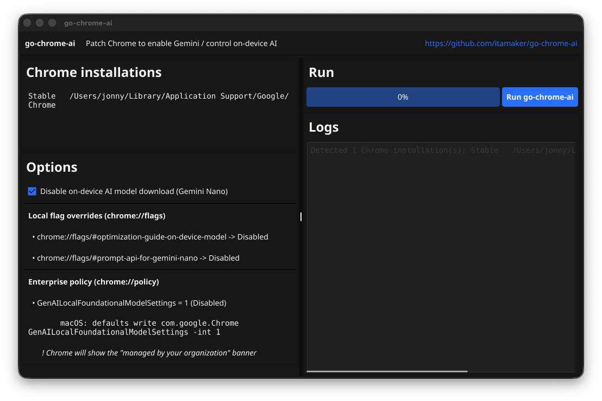

# go-chrome-ai

[English](../README.md) | 中文

`go-chrome-ai` 是一个用 Go 编写的跨平台 Chrome 配置修补工具，同时支持 **CLI** 和 **GUI**。
它可以在不重装 Chrome、不重建用户配置的情况下启用相关 AI 功能（包括 **Ask Gemini**）。

## Support

[](https://buymeacoffee.com/amaker)

## 截图



## Quickstart

### 安装并运行 go-chrome-ai

可按你偏好的方式安装：

```bash
# 从源码构建
make build
```

```bash
# 或通过 Homebrew（自定义 tap）安装
brew tap itamaker/tap
brew install --cask go-chrome-ai
```

在某些 macOS 系统上，首次运行下载的二进制可能会被 Gatekeeper 拦截。可执行：

```bash
xattr -d com.apple.quarantine $(which go-chrome-ai)
```

常见提示如下：

> Apple could not verify “go-chrome-ai” is free of malware that may harm your Mac or compromise your privacy.

然后运行：

```bash
go-chrome-ai        # 命令行模式
go-chrome-ai gui    # 图形界面模式
```

<details>
<summary>也可以从 GitHub Releases 直接下载二进制。</summary>

当前发布包：

- macOS（Apple Silicon/arm64）：`go-chrome-ai-darwin-arm64.tar.gz`
- macOS（Intel/x86_64）：`go-chrome-ai-darwin-amd64.tar.gz`

每个压缩包都只包含一个可执行文件：`go-chrome-ai`。

</details>

它通过修改 Chrome 本地配置来启用相关 AI 功能（如 **Ask Gemini**）：

- 递归将 `is_glic_eligible` 设为 `true`
- 将 `variations_country` 设为 `"us"`
- 将 `variations_permanent_consistency_country` 设为 `["<last_version>", "us"]`（仅当该字段存在且可修改）

## 环境要求

- Go `1.26+`
- 已安装 Google Chrome（Stable / Canary / Dev / Beta）

## 运行 CLI

```bash
go run ./cmd/go-chrome-ai
```

参数：

- `-dry-run`：只显示将修改的内容，不写入文件，也不关闭 Chrome
- `-no-restart`：修补后不重启 Chrome

## 运行 GUI

```bash
go run ./cmd/go-chrome-ai gui
```

GUI 功能：

- 自动检测已安装的 Chrome 渠道
- 一键修补
- 进度条
- 实时日志

## 构建

```bash
go build -o output/go-chrome-ai ./cmd/go-chrome-ai
```

Makefile：

- `make build`
- `make release`：生成 Homebrew cask 需要的发布资产到 `output/release/`

所有构建产物统一输出到 `output/`。

安装后的用法：

```bash
go-chrome-ai        # 命令行模式
go-chrome-ai gui    # 图形界面模式
```

## 执行流程

1. 按系统和渠道检测 Chrome 用户目录。
2. 关闭运行中的 Chrome，避免文件锁。
3. 修改 `Local State`。
4. 重启修补前已运行的 Chrome（可通过参数禁用）。

## 注意事项

- 建议先备份 Chrome `User Data`。
- 请使用拥有该 Chrome 配置的同一系统用户运行。
- 本项目与 Google 无关，风险自担。

## 致谢

[](https://chatgpt.com/codex)

特别感谢 **OpenAI Codex** 为本项目部分代码实现提供的协助。
