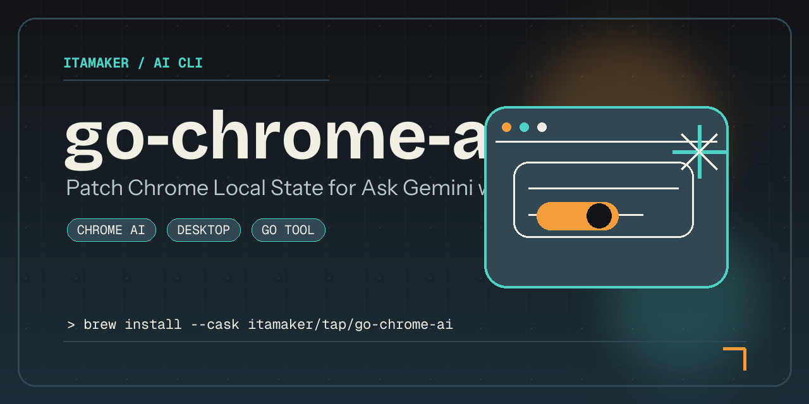

# go-chrome-ai

[English](../README.md) | 中文

`go-chrome-ai` 是一个用 Go 编写的跨平台 Chrome 配置修补工具，同时支持 **CLI** 和 **GUI**。
它可以在不重装 Chrome、不重建用户配置的情况下启用相关 AI 功能（包括 **Ask Gemini**），也可以通过翻转相关的 `chrome://flags` 配合 Google 官方的 [`GenAILocalFoundationalModelSettings`](https://chromeenterprise.google/policies/gen-ai-local-foundational-model-settings/) 企业策略，**阻止 Chrome 静默下载 Gemini Nano 本地大模型**（约 2–4 GB）。



## Support

[](https://buymeacoffee.com/amaker)

## Quickstart

### 安装

```bash
brew install --cask itamaker/tap/go-chrome-ai
```

```bash
curl -fsSL https://raw.githubusercontent.com/itamaker/go-chrome-ai/main/scripts/install.sh | sh
```

<details>
<summary>也可以通过 <a href="https://github.com/itamaker/go-chrome-ai/releases">GitHub Releases</a> 获取二进制。</summary>

每个压缩包都只包含一个可执行文件：`go-chrome-ai`。
macOS 发布包包含 GUI 可执行能力；Linux 和 Windows 发布包默认提供 CLI，便于直接使用。

</details>

### 首次运行

运行：

```bash
go-chrome-ai        # 所有发布包都支持命令行模式
go-chrome-ai gui    # macOS 发布包或源码构建支持图形界面模式
```

在某些 macOS 系统上，首次运行下载的二进制可能会被 Gatekeeper 拦截。可执行：

```bash
xattr -d com.apple.quarantine $(which go-chrome-ai)
```

常见提示如下：

> Apple could not verify “go-chrome-ai” is free of malware that may harm your Mac or compromise your privacy.

它通过修改 Chrome 本地配置来启用相关 AI 功能（如 **Ask Gemini**）：

- 递归将 `is_glic_eligible` 设为 `true`
- 将 `variations_country` 设为 `"us"`
- 将 `variations_permanent_consistency_country` 设为 `["<last_version>", "us"]`（仅当该字段存在且可修改）

同时还可以**阻止 Chrome 下载本地 AI 模型**（Gemini Nano），CLI 与 GUI 都默认开启。该行为会做三件事：

- `chrome://flags/#optimization-guide-on-device-model` -> Disabled
- `chrome://flags/#prompt-api-for-gemini-nano` -> Disabled
- `GenAILocalFoundationalModelSettings = 1` 写入系统受管策略存储
  - macOS：`defaults write com.google.Chrome GenAILocalFoundationalModelSettings -int 1`
  - Linux：`/etc/opt/chrome/policies/managed/go-chrome-ai.json`（需要 sudo）
  - Windows：`HKLM\Software\Policies\Google\Chrome` REG_DWORD

第三步属于企业策略，Chrome 之后会显示「由贵组织管理」横幅。如果你不希望出现该横幅，可以在 CLI 中加 `-disable-ai-download=false`，或在 GUI 中取消勾选该选项。

## 截图


## 环境要求

- Go `1.26+`
- 已安装 Google Chrome（Stable / Canary / Dev / Beta）

## 运行 CLI

```bash
go run ./cmd/go-chrome-ai
```

参数：

- `-dry-run`：只显示将修改的内容，不写入文件，也不关闭 Chrome
- `-no-restart`：修补后不重启 Chrome
- `-disable-ai-download`（默认 `true`）：阻止本地 AI 模型下载——禁用相关的 `chrome://flags` 并向系统受管策略存储写入 `GenAILocalFoundationalModelSettings=1`。使用 `-disable-ai-download=false` 可跳过

## 运行 GUI

```bash
go run ./cmd/go-chrome-ai gui
```

Linux 和 Windows 的预编译发布包默认只包含 CLI；如果需要 Fyne GUI，请从源码构建。

GUI 功能：

- 自动检测已安装的 Chrome 渠道
- 左右分栏布局（左侧参数配置，右侧执行控件 + 日志）
- 一键修补
- 进度条
- 实时日志
- 「Disable on-device AI model download」开关，会在执行前预览将要应用到 `chrome://flags` 与 `chrome://policy` 的具体改动

## 从源码构建

```bash
make build
```

```bash
go build -o output/go-chrome-ai ./cmd/go-chrome-ai
```

Makefile：

- `make build`
- `make release-check`：校验 `.goreleaser.yaml`
- `make snapshot`：通过 GoReleaser 生成发布资产到 `dist/`

本地构建输出到 `output/`，GoReleaser 打包输出到 `dist/`。

安装后的用法：

```bash
go-chrome-ai        # 所有发布包都支持命令行模式
go-chrome-ai gui    # macOS 发布包或源码构建支持图形界面模式
```

## 执行流程

1. 按系统和渠道检测 Chrome 用户目录。
2. 关闭运行中的 Chrome，避免文件锁。
3. 修改 `Local State`。
4. 重启修补前已运行的 Chrome（可通过参数禁用）。

## 注意事项

- 建议先备份 Chrome `User Data`。
- 请使用拥有该 Chrome 配置的同一系统用户运行。
- 本项目与 Google 无关，风险自担。

## 致谢

[](https://chatgpt.com/codex)

特别感谢 **OpenAI Codex** 为本项目部分代码实现提供的协助。
